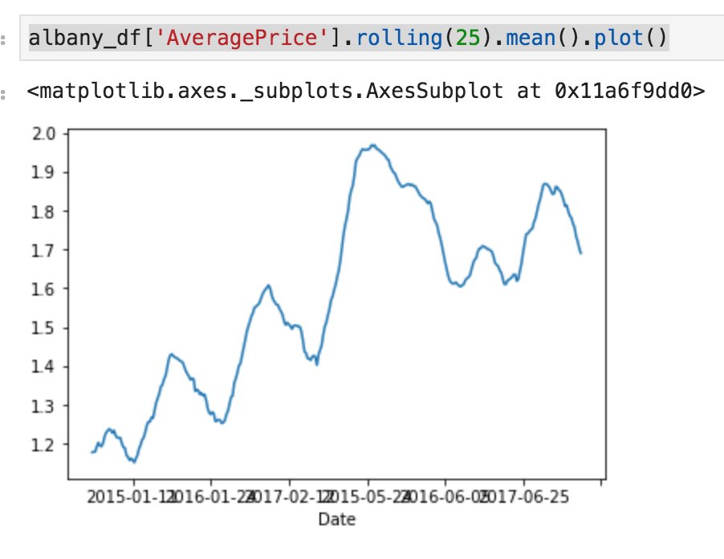
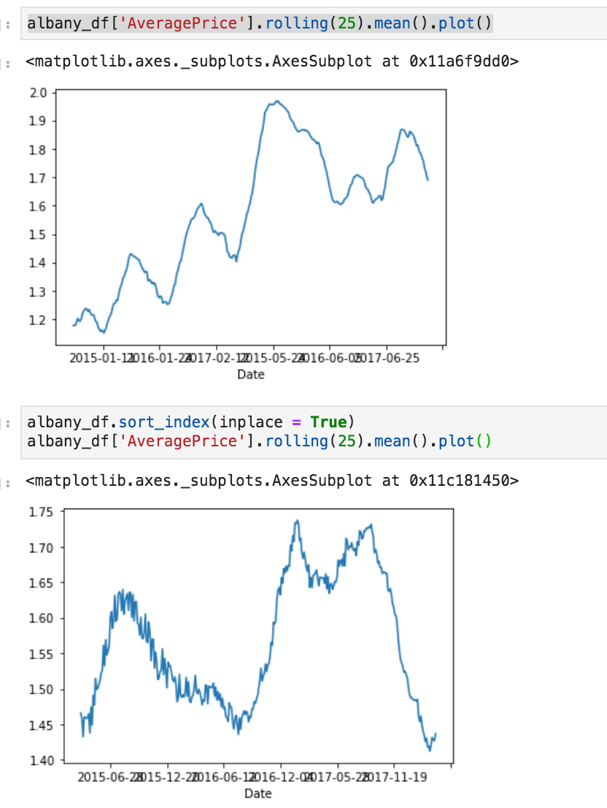
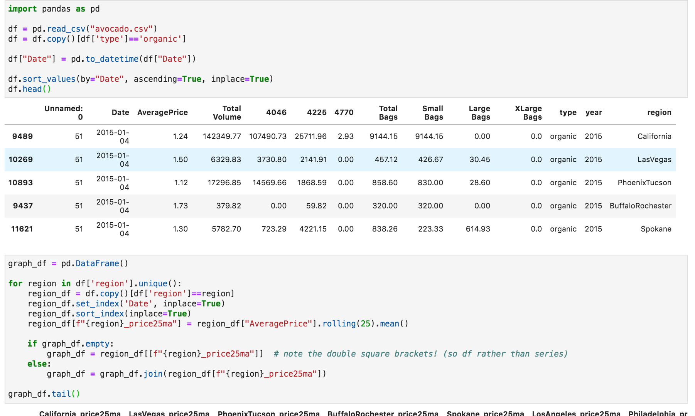
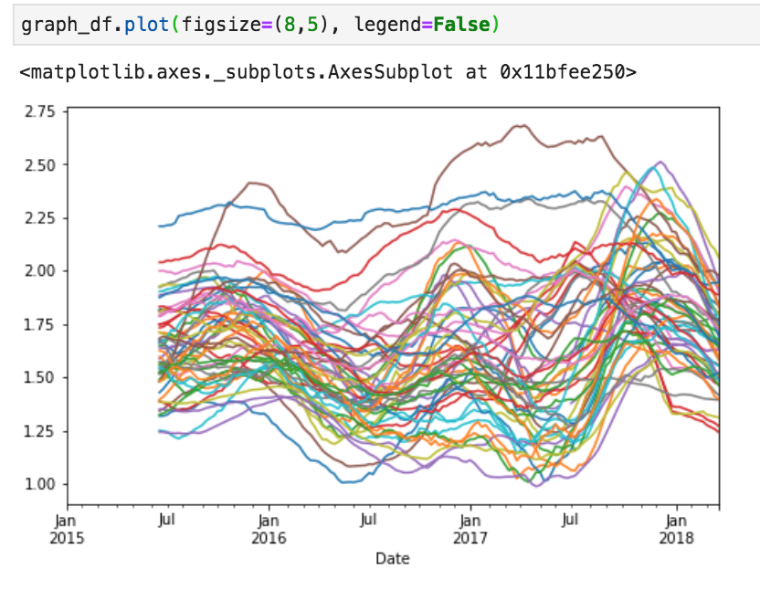
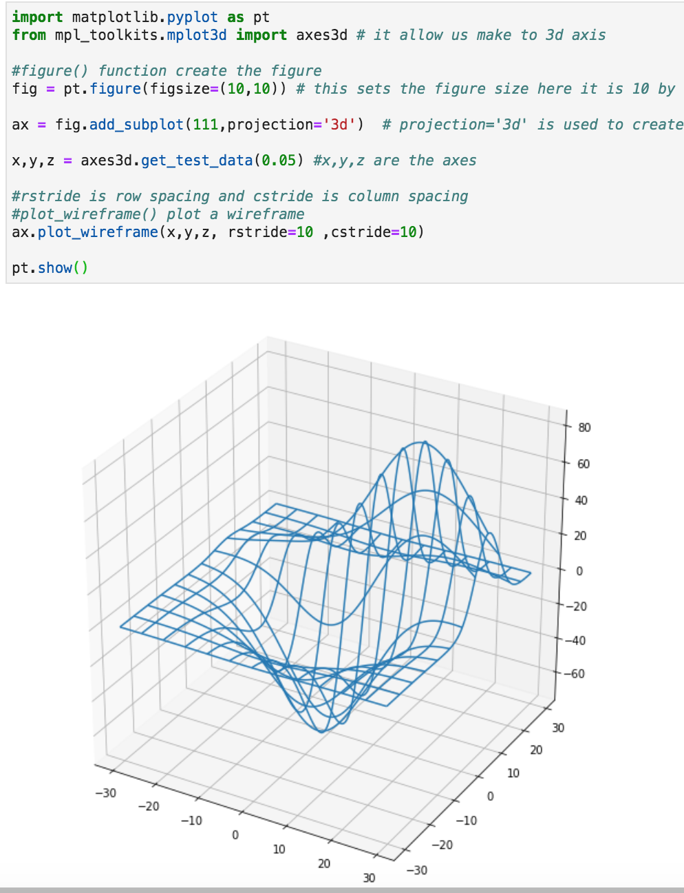
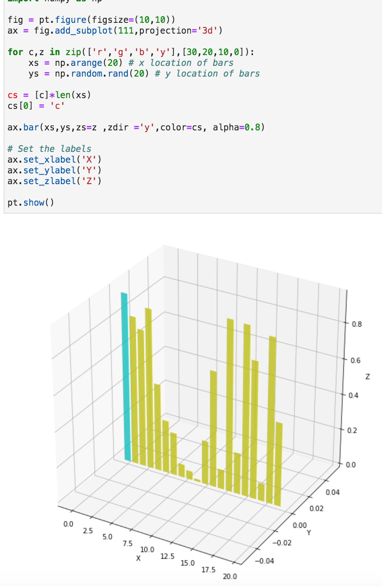
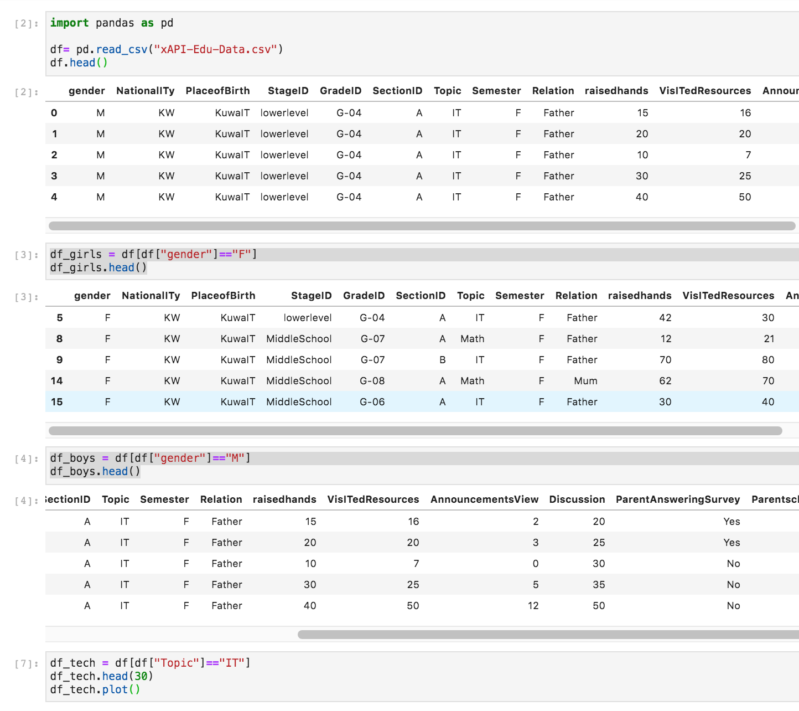
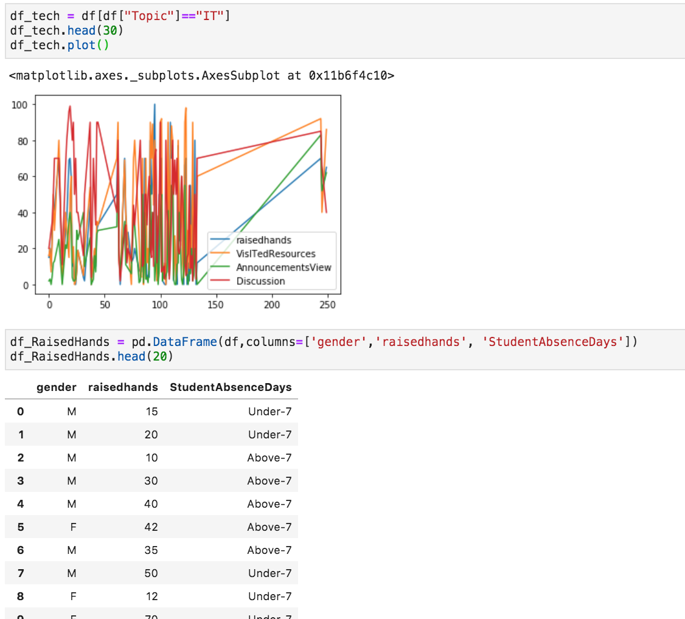
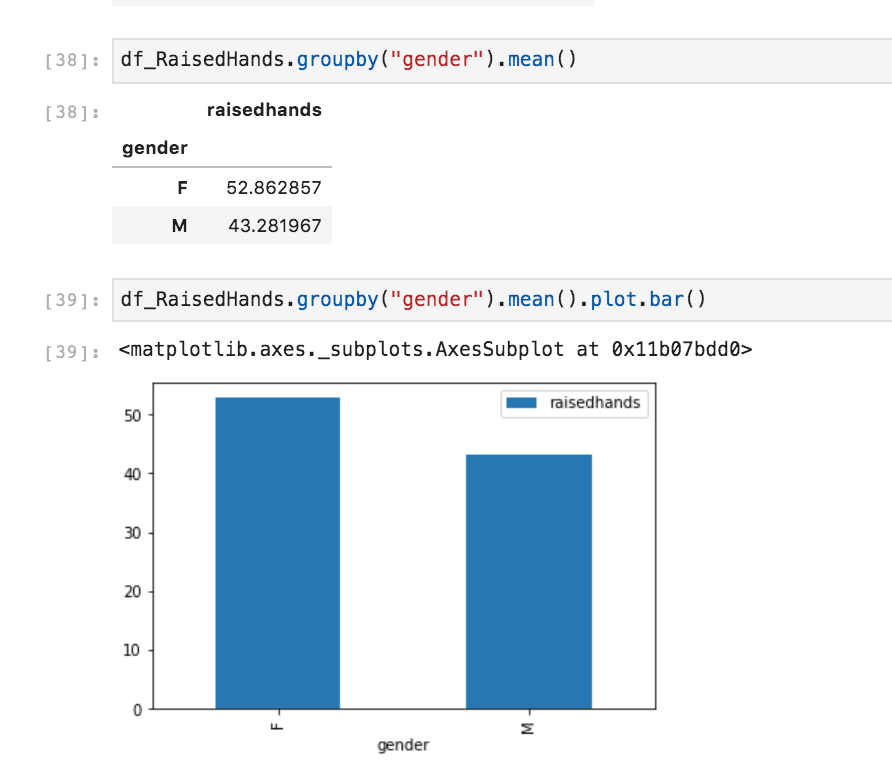
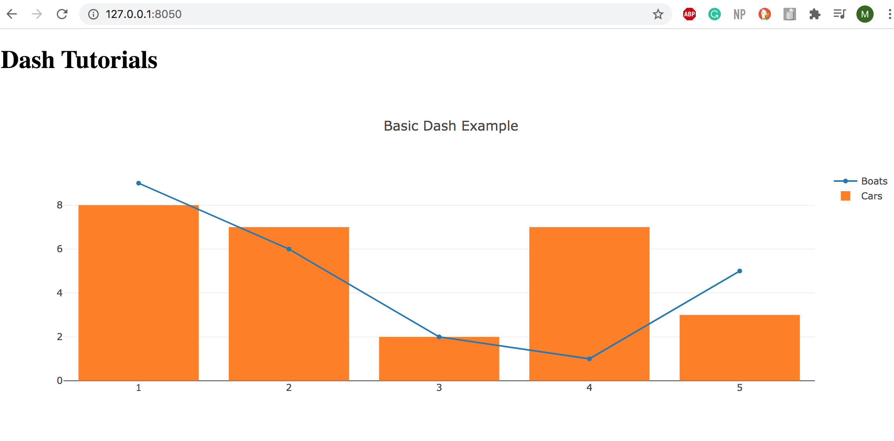

# Data Visualizations

This is a compiled folder with all my data explorations. Run in JupyterLab.

# Project 1: Avocado Region Data
I explored data with prices, region, and more information about avocados overtime.

# Project 2: Exploring 3d Visualizations

# Project 3: Girls and Boys Studying IT and Raising Hands
I wanted to explore the difference between the rate at which girls and boys who study IT at an early age raise their hands in class and how this has an effect on educational outcomes. Data is collected from an observational study which counted hand raising in different classes from students throughout classrooms in the Middle East. 

# Project 4: Trying Dash

Made a really quick dash project based on a tutorial.

